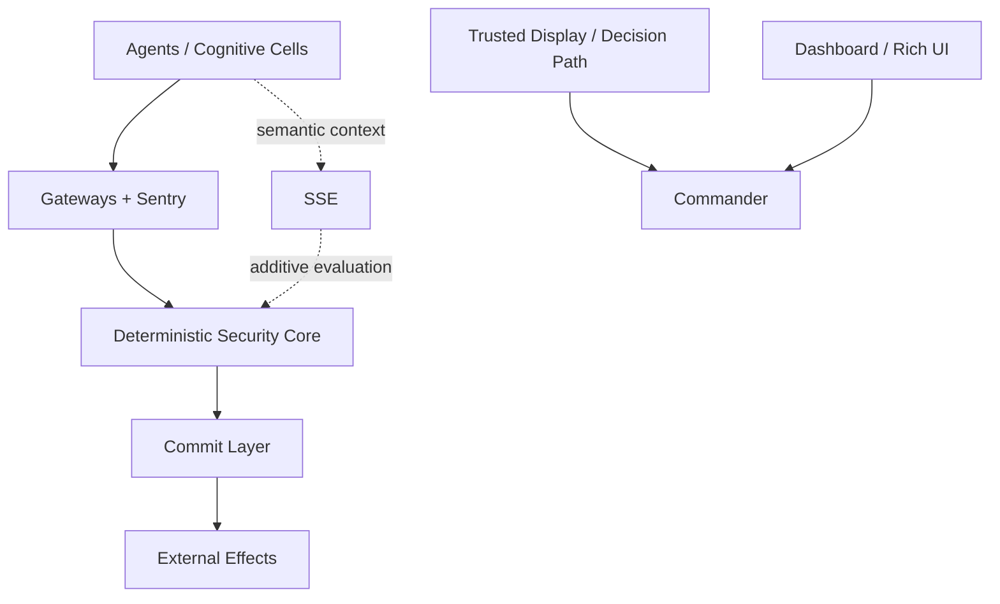
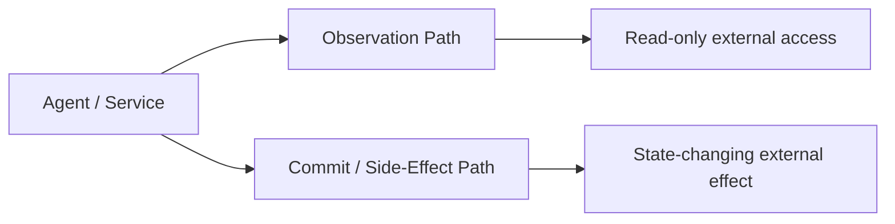
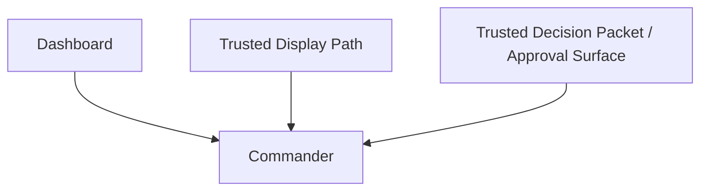
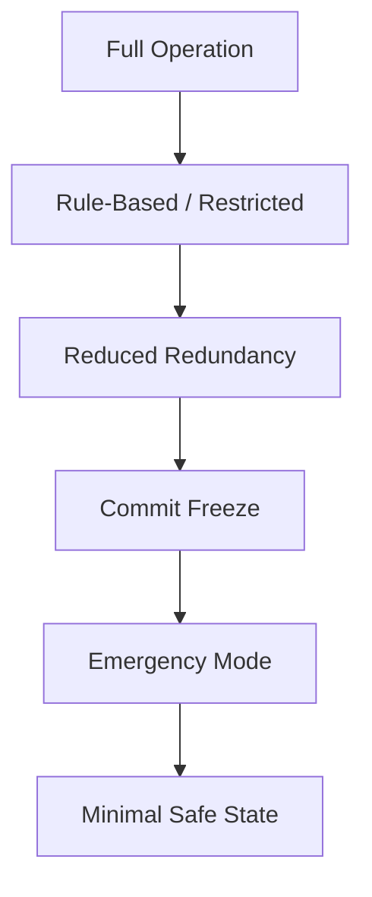
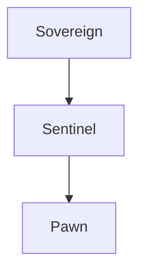
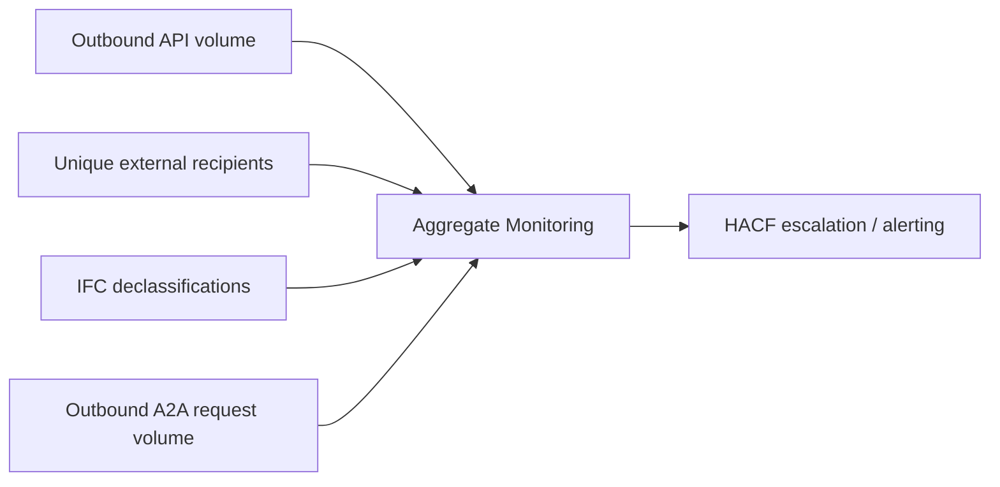

# MAOS — Visual Architecture Guide v5.8

**Version:** 5.8.0  
**Date:** March 31, 2026  
**Status:** Companion — Visual and Didactic Guide  
**Normative status:** Mostly non-normative. This guide explains the architecture visually and textually. Canonical baselines are explicitly marked.

---

## 1. How to read this guide

Each visual or visual description should be read using one of these labels:

- **Normative** — directly reflects a canonical core baseline
- **Profile-specific** — differs by security profile
- **Simplified** — compressed for teaching clarity
- **Conceptual** — explanatory metaphor, not a formal guarantee

---

## 2. Core visual legend

| Marker | Meaning |
|-------|---------|
| solid boundary | hard trust / execution boundary |
| dashed boundary | conceptual or deployment grouping |
| solid arrow | required path |
| dotted arrow | optional or profile-dependent path |
| eye icon / read path | observation or read-only access |
| bolt / commit path | state-changing external effect |
| red lock | constitutional restriction / fail-closed behavior |
| amber block | degraded but controlled state |
| red block | emergency or frozen state |

---

## 3. Canonical architecture snapshot
**Label:** Simplified

**Interpretation note:**  
Semantic evaluation assists but does not replace deterministic enforcement.

---

## 4. Observation path vs. external-effects path
**Label:** Normative-in-spirit, simplified from core

### Visual note

- the **Observation Path** remains controlled and auditable,
- but it is not the same as the Commit path,
- and only the side-effect path creates irreversible external consequences.

### v5.8 nuance

Outbound requests to external A2A agents are now explicitly treated as an information-exposure surface for monitoring purposes, even when they are not themselves “commits” in the classic sense.

---

## 5. Human oversight surfaces
**Label:** Normative baseline, visually simplified

| Surface | Trust interpretation |
|--------|----------------------|
| Dashboard | richest information, not root of trust |
| Trusted Display Path | minimal truth channel |
| Trusted Decision Packet | trusted action context for consequential approvals |

---

## 6. Canonical degradation ladder
**Label:** Normative baseline, simplified from Core §38.11

### Additional v5.8 note

Repeated ECS cycles now matter not only per day but cumulatively across a longer window.  
Recovery-state visuals should therefore annotate repeated-ECS escalation and profile-specific human gating.

---

## 7. Distributed trust hierarchy
**Label:** Profile-specific / simplified

### Important nuance

The real semantics depend on:

- policy-epoch validity,
- cached capability TTL,
- partition duration,
- and whether privilege growth or state-changing effects are being attempted.

v5.8 emphasizes that TTL and stale-epoch logic must be considered together, not in isolation.

---

## 8. Isolation ladder
**Label:** Profile-specific

| Isolation mode | Typical examples | Security interpretation |
|---------------|------------------|-------------------------|
| lightweight isolate | language/runtime isolate | fast, weaker containment |
| process sandbox | OS process with restrictions | moderate containment |
| containerized boundary | hardened container | stronger than process alone if configured well |
| strong sandbox | gVisor / Kata-like isolation | high containment target |
| microVM / confidential style isolation | hardware-assisted strong isolation | strongest deployment-oriented target |

### Standard profile note

v5.8 makes it explicit that Standard should **not** be visually or rhetorically presented as if it delivered the same isolation class as Hardened or Isolated.

---

## 9. Aggregate monitoring concept
**Label:** Profile-specific / simplified

### Reading tip

This visual exists to show that some suspicious behavior is detectable only in aggregate.  
It does **not** imply that all semantic exfiltration can be detected by volume or count thresholds.

---

## 10. Seven-layer “heart” visualization guidance
**Label:** Conceptual

The seven protective layers around the DSC remain a useful explanatory image.

v5.8 caution:

> this image communicates defense in depth, not literal invulnerability.

Use it to illustrate layered protection, not impossibility of compromise.

---

## 11. Residual-risk annotation pattern

Every major visual in this guide should be paired with a short annotation box stating:

- what is simplified,
- what is profile-dependent,
- what is conceptual,
- and what should not be over-inferred.

Example:

> **Residual-risk note:** Aggregate monitoring can detect some low-and-slow exfiltration patterns, but not every semantically transformed leakage chain.

---

## 12. About the organism metaphor
**Label:** Conceptual

The organism metaphor remains useful for intuition:

- heart = DSC,
- immune system = detection, quarantine, SSE layers,
- skeleton = commit and structural runtime,
- skin = sentries and gateways,
- nerves = message flow and signals.

It helps explain the system.  
It does not replace the constitutional architecture.

---

*MAOS Visual Architecture Guide v5.8 — visual explanation with clearer profile nuance, trusted decision surfaces, and aggregate-monitoring didactics.*  
